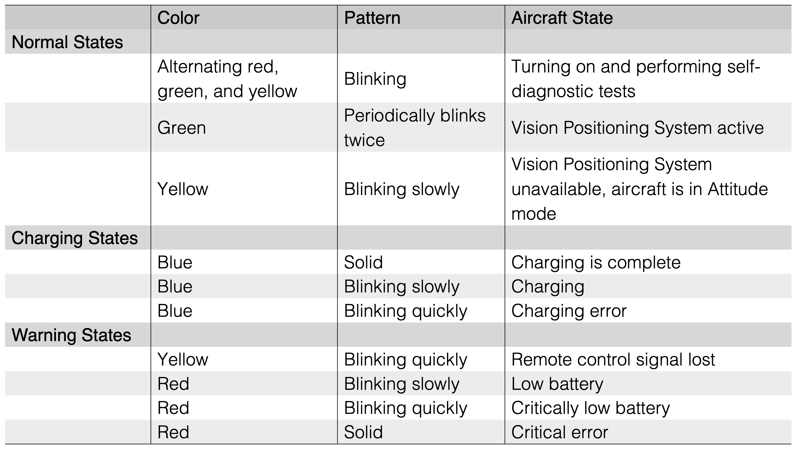

# Drone Status Indicator States

The best way to understand the different states of the drone status indicator is to see them in action. The following table lists the different states and their meanings.

- Blue LED: The blue LED is the main status indicator for charging states.
- Red LED: The red LED is the main status indicator for the drone's Battery charge level.
- Green/Yellow LED: The green/yellow and yellow states and there combination are general status indicators for the drone.

