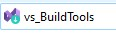
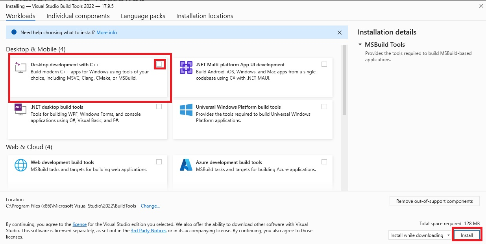

# How to install Visual C++ Build tools 

1. Download the installer [here](https://aka.ms/vs/17/release/vs_buildtools.exe)
2. Once downloaded click on the downloaded file and open the installer 
   
   
3. During installation, make sure to select "Desktop development with C++" workload
4. 