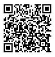

# Manual Control with Smartphone
   
Learn how to control the drone manually using your smartphone.

Lets get a feel for the drone by controlling it manually. 

1. [Download](https://www.dji.com/de/downloads/djiapp/tello) the Tello app on your smartphone and connect to the drone's WiFi network. 

2. Open the app and you should see a live feed from the drone's camera. 
3. You can now control the drone using the on-screen controls.

