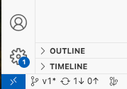

# Setting up the Environment

## Option 1: Using a Virtual Python Environment

### Dependencies

Before starting, ensure you have the following:

- [Python 3.11](https://www.python.org/downloads/release/python-3115/) or newer

### 1. Create a Virtual Environment
   
Navigate to the project root directory in your terminal and run the following command:

```bash
python -m venv venv
```

This command creates a new virtual environment named venv in your project directory.

Activate the Virtual Environment:
On Windows, run:
```bash
.\venv\Scripts\activate
```

On macOS and Linux, run:
```bash
source venv/bin/activate
```

You'll notice the command prompt changes to indicate that the virtual environment is active.

### 2. Install Dependencies

With the virtual environment activated, install the project dependencies using:
```bash
pip install -r requirements.txt
```

This command reads the requirements.txt file and installs all the required Python packages.
Remember to activate the virtual environment each time you work on this project.

## Option 2: Using a Dev Container with VS Code (Linux Only)

Alternatively, you can use a dev container with Visual Studio Code for a pre-configured development environment. 

This option is currently only verified to work on Linux systems.

1. Install Docker on your system.
2. Install the Remote - Containers extension in VS Code.
3. Open the project folder in VS Code.
4. Click on the button in the lower-left corner of the VS Code window and select "Remote-Containers: Reopen in Container".

<div align="center">
  
</div>


This will build and start the dev container, providing you with a ready-to-use development environment.

## Option 3: Using Conda

Conda is a powerful tool that allows for the management of packages, dependencies, and environments. Its use is not limited to Python projects, as it can manage packages from any language.

### Dependencies
Before starting, ensure you have the following:

[Miniconda](https://docs.anaconda.com/free/miniconda/index.html) or Anaconda
1. Create a Conda Environment
Navigate to the project directory in your terminal and run the following command:

```bash
conda create --name myenv python=3.11
```

Replace myenv with your desired environment name. This command creates a new Conda environment named myenv with Python 3.11. As a recommendation you could name the environment tellodrone.

2. Activate the Conda Environment
Activate the Conda environment by running:

```bash
conda activate myenv
```
You'll notice the command prompt changes to indicate that the Conda environment is active.

1. Install Dependencies
With the Conda environment activated, you can install project dependencies. If you have a requirements.txt file, you can use:

```bash
pip install -r requirements.txt
```

Remember to activate the Conda environment each time you work on this project.